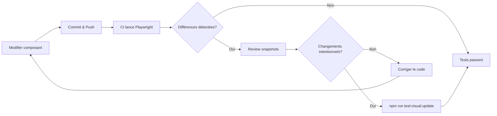

# Tests visuels de régression avec Playwright

Guide de configuration et d'utilisation des tests visuels de régression pour le design system.

## Qu'est-ce que Playwright Visual Testing ?

[Playwright](https://playwright.dev/) permet de capturer des screenshots de vos composants et de les comparer automatiquement pour détecter les régressions visuelles.

## Pourquoi utiliser Playwright ?

- **Gratuit et open-source** : Pas de limite de snapshots
- **Intégré aux tests e2e** : Même framework pour tests fonctionnels et visuels
- **Multi-navigateurs** : Chrome, Firefox, Safari
- **CI/CD** : Intégration native avec GitHub Actions
- **Rapide** : Exécution parallèle

## Configuration

### Installation

```bash
npm install -D @playwright/test
npx playwright install chromium
```

### Structure des tests

```
tests/
├── e2e/              # Tests fonctionnels
│   ├── modal.spec.ts
│   ├── dropdown.spec.ts
│   └── ...
└── visual/           # Tests visuels
    └── components.spec.ts
```

### Configuration Playwright

```typescript
// playwright.config.ts
import { defineConfig } from '@playwright/test';

export default defineConfig({
  testDir: './tests',
  fullyParallel: true,
  reporter: 'html',
  use: {
    baseURL: 'http://localhost:4200',
    trace: 'on-first-retry',
  },
  webServer: {
    command: 'npm run showcase',
    url: 'http://localhost:4200',
    reuseExistingServer: !process.env.CI,
  },
  // Visual regression settings
  expect: {
    toHaveScreenshot: {
      maxDiffPixels: 100,
    },
  },
});
```

## Utilisation

### Écrire un test visuel

```typescript
// tests/visual/components.spec.ts
import { test, expect } from '@playwright/test';

test('ds-button visual', async ({ page }) => {
  await page.goto('/components/actions/ds-button');
  await page.waitForSelector('ds-button');
  await expect(page).toHaveScreenshot('ds-button.png', {
    fullPage: false,
    maxDiffPixels: 100,
  });
});
```

### Commandes npm

```bash
# Lancer les tests visuels
npm run test:visual

# Mettre à jour les snapshots (après changement intentionnel)
npm run test:visual:update

# Lancer les tests e2e
npm run test:e2e

# Ouvrir le rapport HTML
npx playwright show-report
```

### En local

```bash
# Build du Showcase
npm run showcase:build

# Lancer les tests visuels
npm run test:visual
```

### Dans la CI

Le workflow `.github/workflows/chromatic.yml` (renommé pour la rétrocompatibilité) :

1. Build le Showcase
2. Lance les tests visuels Playwright
3. Upload les snapshots comme artifacts
4. Commente la PR en cas de différences

## Workflow typique



## Bonnes pratiques

### 1. Données stables

Utilisez des données fixes pour éviter les faux positifs :

```typescript
// Page de test avec données fixes
defaultSlides = [
  { id: 'slide-1', image: 'https://picsum.photos/800/400?random=1', ... },
];
```

### 2. Attendre le chargement

```typescript
test('component visual', async ({ page }) => {
  await page.goto('/components/...');
  await page.waitForLoadState('networkidle');
  await page.waitForSelector('.ds-component');
  await expect(page).toHaveScreenshot();
});
```

### 3. Masquer les éléments dynamiques

```typescript
await page.evaluate(() => {
  document.querySelectorAll('.animated').forEach(el => {
    el.style.animation = 'none';
  });
});
```

### 4. Tester plusieurs états

```typescript
test.describe('ds-button visual states', () => {
  test('default state', async ({ page }) => {
    await page.goto('/test/button');
    await expect(page.locator('[data-testid="button-default"]'))
      .toHaveScreenshot('button-default.png');
  });

  test('hover state', async ({ page }) => {
    await page.goto('/test/button');
    await page.hover('[data-testid="button-default"] button');
    await expect(page.locator('[data-testid="button-default"]'))
      .toHaveScreenshot('button-hover.png');
  });
});
```

## Gestion des snapshots

### Structure des fichiers

```
tests/visual/
├── components.spec.ts
└── components.spec.ts-snapshots/
    ├── ds-button-chromium-linux.png
    ├── ds-button-chromium-darwin.png
    └── ...
```

### Mettre à jour après changement intentionnel

```bash
# Après modification volontaire de l'apparence
npm run test:visual:update

# Vérifier les changements
git diff tests/visual/

# Commit les nouveaux snapshots
git add tests/visual/*.png
git commit -m "chore: update visual snapshots for ds-button redesign"
```

### Cross-platform

Les snapshots peuvent différer entre OS. Options :
1. Utiliser `maxDiffPixels` pour tolérance
2. Générer snapshots dans CI (Linux)
3. Utiliser Docker localement

## Ressources

- [Playwright Visual Comparisons](https://playwright.dev/docs/test-snapshots)
- [Playwright Configuration](https://playwright.dev/docs/test-configuration)
- [GitHub Actions Setup](https://playwright.dev/docs/ci-intro)

## Support

Pour toute question sur les tests visuels :
- Ouvrir une issue : [GitHub Issues](https://github.com/sopequenoteck/design-system/issues)
- Documentation : [CLAUDE.md](./CLAUDE.md)
