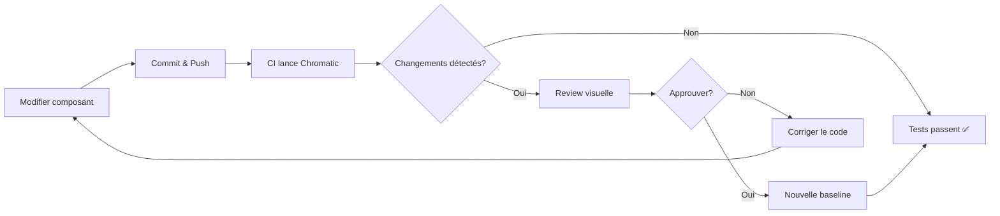

# Tests visuels de régression avec Chromatic

Guide de configuration et d'utilisation des tests visuels de régression pour le design system.

## Qu'est-ce que Chromatic ?

[Chromatic](https://www.chromatic.com/) est un service de tests visuels de régression pour Storybook. Il capture des snapshots de vos composants et détecte automatiquement les changements visuels entre les versions.

## Pourquoi utiliser Chromatic ?

- ✅ **Détection automatique** des régressions visuelles
- ✅ **Review collaborative** des changements UI
- ✅ **Historique visuel** de l'évolution des composants
- ✅ **Intégration CI/CD** avec GitHub Actions
- ✅ **Gratuit** pour les projets open-source (5000 snapshots/mois)

## Configuration (optionnelle)

### Prérequis

1. Compte Chromatic (gratuit pour open-source)
2. Token de projet Chromatic
3. Accès aux secrets GitHub du repository

### Étapes de configuration

#### 1. Créer un projet Chromatic

```bash
# Se connecter à Chromatic
npx chromatic --project-token=<votre-token>

# Ou via l'interface web
# https://www.chromatic.com/start
```

#### 2. Ajouter le secret GitHub

1. Aller dans **Settings** > **Secrets and variables** > **Actions**
2. Créer un nouveau secret : `CHROMATIC_PROJECT_TOKEN`
3. Coller le token obtenu depuis Chromatic

#### 3. Configurer le projet

Mettre à jour `.chromatic.json` :
```json
{
  "projectId": "VOTRE_PROJECT_ID",
  "buildScriptName": "build-storybook",
  "storybookBuildDir": "storybook-static",
  "autoAcceptChanges": "master",
  "exitZeroOnChanges": false
}
```

#### 4. Activer le workflow GitHub

```bash
# Renommer le fichier example
mv .github/workflows/chromatic.yml.example .github/workflows/chromatic.yml
```

## Utilisation

### En local

```bash
# Lancer les tests visuels
npm run test:visual

# Avec auto-accept des changements
npx chromatic --auto-accept-changes
```

### Dans la CI

Le workflow `.github/workflows/chromatic.yml` s'exécute automatiquement sur :
- **Pull Requests** : détecte les changements visuels, demande review
- **Push sur master** : accepte automatiquement comme baseline

### Review des changements

1. Le workflow publie un commentaire avec le lien Chromatic
2. Cliquer sur le lien pour voir les changements détectés
3. Accepter ou rejeter les changements visuels
4. Les changements acceptés deviennent la nouvelle baseline

## Workflow typique



## Bonnes pratiques

### 1. Ignorer les changements intentionnels

Si vous modifiez intentionnellement l'apparence d'un composant :
1. Review et accepter les changements dans Chromatic
2. Documenter le changement dans le CHANGELOG
3. Considérer si c'est un breaking change

### 2. Gérer les faux positifs

Certains éléments peuvent causer des faux positifs :
- Dates/timestamps
- Données aléatoires
- Animations en cours

**Solutions** :
```typescript
// Dans vos stories, utiliser des données fixes
export const Default: Story = {
  args: {
    timestamp: new Date('2025-01-01').toISOString(),
    random: 0.5, // Valeur fixe au lieu de Math.random()
  },
};
```

### 3. Optimiser les snapshots

```json
// .chromatic.json
{
  "onlyChanged": true,  // Ne teste que les composants modifiés
  "externals": [
    "projects/ds-angular/src/styles/**/*.scss"  // Ignore les fichiers externes
  ],
  "skip": "dependabot/**"  // Skip les PRs automatiques
}
```

## Alternatives à Chromatic

Si Chromatic n'est pas adapté à votre projet, voici des alternatives :

### Percy (Browserstack)

```bash
npm install --save-dev @percy/cli @percy/storybook

# Dans package.json
"test:visual": "percy storybook ./storybook-static"
```

### Playwright visual comparisons

```typescript
// tests/visual/button.spec.ts
test('ds-button should match snapshot', async ({ page }) => {
  await page.goto('/iframe.html?id=components-button--primary');
  await expect(page).toHaveScreenshot();
});
```

### Backstop.js (gratuit, local)

```bash
npm install --save-dev backstopjs

# Dans package.json
"test:visual": "backstop test"
```

## Coûts

| Outil | Gratuit | Payant |
|-------|---------|--------|
| **Chromatic** | 5000 snapshots/mois (open-source) | À partir de $149/mois |
| **Percy** | 5000 snapshots/mois (open-source) | À partir de $399/mois |
| **Playwright** | ✅ Illimité | - |
| **Backstop.js** | ✅ Illimité | - |

## Ressources

- [Documentation Chromatic](https://www.chromatic.com/docs/)
- [Chromatic GitHub Action](https://github.com/chromaui/action)
- [Storybook Visual Testing](https://storybook.js.org/docs/writing-tests/visual-testing)
- [Percy for Storybook](https://docs.percy.io/docs/storybook)

## Support

Pour toute question sur la configuration des tests visuels :
- Ouvrir une issue : [GitHub Issues](https://github.com/votre-org/design-system/issues)
- Documentation : [CLAUDE.md](./CLAUDE.md)
